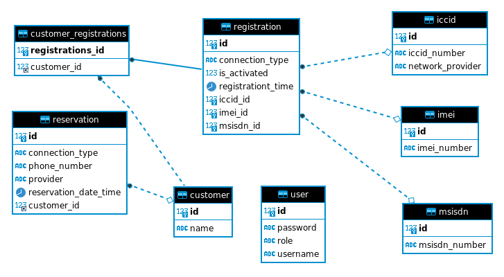

## **CAPSTONE PROJECT**

## Expected anchor links:

[Backend Code with Documentation](#backend-code-with-documentation)

[Frontend Code with Documentation](#frontend-code-with-documentation)

[ER Diagram / Database Model Visualization](#er-diagram--database-model-visualization)

[Test Coverage Report](#test-coverage-report)

# **Wireless Inventory Number Management**

(Software Requirements Specification)

**9th-Oct-2023**

**Submitted to: Aruvi**    

**Submitted by: Sandhya Shevatre**

**Prodapt  University, Hyderabad**

**Table of Contents**

|1|Introduction|
| :- | :- |
||
1\.1. Purpose

1\.2. Scope
|
|2|System Description|
||
2\.1. System Overview

2\.2. System Architecture

2\.3. Data Flow Diagram

2\.4. Technology Stack
|
|3|Functional Requirements|
||
3\.1. Use Case 1

3\.2. Use Case 2
|
|4|Non-Functional Requirements|
||
4\.1. Performance Requirements

4\.2. Security Requirements

4\.3. User Interface Requirements

4\.4. Database Requirements

4\.5. Compatibility Requirements
|
|5|User Interface Design|
||
5\.1. Wireframes

5\.2. Mockups
|
|6|Data Model|
||
6\.1. Entity-Relationship Diagram

6\.2. Database Schema

|
|7|API Specification|
||
7\.1. API Endpoints

7\.2. Data Formats

7\.3. Authentication and Authorization
|
|8|Security|
||
8\.1. Authentication

8\.2. Authorization

8\.3. Data Encryption
|
|9|Testing|
||
9\.1. Unit Testing

9\.2. Integration Testing

9\.3. User Acceptance Testing
|
|10|Deployment|
||
10\.1. Deployment Architecture

10\.2. Deployment Instruction
|

 ## **1. Introduction**

**1.1 Purpose**

The purpose of this document is to outline the requirements for the development of the Wireless Inventory Number Management system. It focuses on defining both the functional and non-functional aspects necessary for successful system implementation.

**1.2 Scope**

The system is designed to manage ICCID, MSISDN, and IMEI numbers in wireless networks. This encompasses the  reservation, and allocation of these numbers, with the primary aim of benefiting wireless service providers by streamlining their inventory management processes.

**1.3 Definitions**

For clarity, here are some key definitions:

- ICCID (Integrated Circuit Card Identifier): A unique identifier associated with SIM cards, vital for their identification and functionality.
- example:-     8991000904443084459U (MMCC-IINN-NNNN-NNNN-NN-C(X) format where,
- MM = Constant (ISO 7812 Major Industry Identifier)
- CC = Country Code
- II = Issuer Identifier
- N{12} = Account ID ("SIM number")
- C = Checksum calculated from the other 19 digits using the Luhn algorithm.
- x = An extra 20th digit is returned by the 'AT!ICCID?' command, but it is not officially part of the ICCID.)
- MSISDN (Mobile Station International Subscriber Directory Number): A mobile phone number within the global cellular network, used to route calls and messages.
- IMEI (International Mobile Equipment Identity): A globally unique identifier assigned to mobile devices, crucial for device identification and tracking.

 ## **2. System Description**

**2.1 System Overview**

The system consists of two primary components: a backend developed using Java Spring Boot and a frontend built with React.js. Together, they provide the capability for users to efficiently reserve and manage wireless numbers.

**2.2 System Architecture**

The system follows a client-server architecture with a RESTful API, facilitating seamless communication between the frontend and backend components

**2.3 Data Flow**

The system's data flow begins with user input through the frontend. This data is then processed in the backend, where it undergoes various operations. Subsequently, the processed results are relayed back to the frontend for display.

**2.4 Technology Stack**

- The system's technology stack comprises the following key components:
- Backend: Java 11, Spring Boot 2.7.13
- Frontend: React.js
- Database: MySQL (MySQLdatabase technology)

## **3. Functional Requirements**

**3.1 Use Cases**

The system encompasses several essential functionalities, including:

- Reservation of Numbers: Users can reserve ICCID, MSISDN, and IMEI numbers, ensuring their availability for future use.
- Allocation to Customers: When numbers are allocated to customers, the system will associate ICCID with the corresponding MSISDN and IMEI.
- Tracking and Availability: The system diligently tracks reservation dates and monitors the availability of numbers, aiding users in making informed decisions regarding number allocation.

## **4. Non-Functional Requirements**

**4.1 Performanc**e

The system's performance expectations include:

Responsiveness: The system should exhibit responsiveness, ensuring that actions such as number reservation are carried out with minimal latency.

**4.2 Security**

Security is of paramount importance in the Wireless Inventory Number Management system. 
It encompasses several measures to safeguard sensitive data and control access to the system effectively.

***Authentication and Authorization***

Authentication and authorization mechanisms will be implemented to ensure that users have controlled access to the system. This is achieved through the use of JSON Web Tokens (JWT), which provide a secure and efficient means of user authentication and authorization.

**Authentication:**

- JWT-Based Authentication: The system will employ JWT-based authentication to verify the identity of users during login. Upon successful authentication, the system will issue a JWT token to the user.
- User Credentials: Users will be required to provide valid credentials, typically a username and password, during login.
- Token Expiry: JWT tokens will have a predefined expiry time, after which they will need to be renewed or reacquired.

**Authorization:**

- Role-Based Access Control (RBAC): The system will adopt Role-Based Access Control, where users are assigned specific roles (e.g., admin, regular user). These roles determine the level of access a user has within the system.
- Authorization Claims: JWT tokens will contain claims or attributes specifying a user's role and permissions. The system will use these claims to enforce access control policies.
- Resource Protection: Authorization rules will be in place to protect sensitive resources, ensuring that users can only access data and perform actions for which they have the appropriate permissions.

**4.3 User Interface**

The user interface design will adhere to the following criteria:

- User-Friendly Design: The user interface will be intuitively designed for ease of use.
- Responsiveness: The interface will be responsive to various screen sizes and devices, ensuring a consistent user experience.

**4.4 Database**

The system's database requirements encompass the following:

Database Technology: The choice of database technology (e.g., MySQL) will be made with data security and efficiency in mind.

**4.5 Compatibility**

The system will ensure compatibility as follows:

Cross-Browser Compatibility: The frontend will be designed to function seamlessly across different web browsers, providing a consistent experience to all users.

## **5. User Interface Design**

- The user interface will prioritize simplicity and user-friendliness. It will include:
- Simple Forms: The UI will incorporate straightforward forms for number reservation.
- Intuitive Layout: The layout will be designed with user intuitiveness in mind, enhancing the tracking of reservations.

## **7. API Specification**

The system will define RESTful API endpoints with specifications covering:

- Reserving Numbers: API endpoints will be provided for reserving ICCID, MSISDN, and IMEI numbers.
- Association: APIs will enable the association of ICCID with corresponding MSISDN and IMEI.
- Availability Checks: Endpoints for checking the availability of numbers will also be included.

## **8. Security**

Security measures will be implemented, including:

-Authentication: Users will be required to authenticate themselves before accessing the system.

-Authorization: Authorization mechanisms will control user access based on defined roles and permissions.

-Data Encryption: Sensitive data transmission will be encrypted to protect against unauthorized access.

## **9. Testing**

A comprehensive testing strategy will be employed, encompassing the following:

- Unit Testing: Testing of individual components, ensuring their functionality in isolation.
- Integration Testing: Verification of interactions between different system components.
- User Acceptance Testing: Evaluation of the system's compliance with user requirements and expectations.

## **10. Deployment**

Deployment of the system will involve the following:

- Deployment Architecture: The architecture for deploying the backend and frontend in a production environment will be determined.
- Deployment Instructions: Detailed instructions will be provided to guide the deployment process, ensuring successful implementation.

## **Data Encryption**

To ensure the confidentiality of sensitive data transmitted between the frontend and backend components, the system will employ data encryption.

- Secure Communication: All data transferred between the frontend and backend will be transmitted over secure, encrypted connections using HTTPS (SSL/TLS) protocols.
- End-to-End Encryption: Sensitive information, such as user credentials and authentication tokens, will be encrypted before transmission, making it nearly impossible for unauthorized parties to intercept or decipher the data in transit.
- These security measures, including JWT-based authentication and data encryption, will be implemented rigorously to safeguard user data and protect the integrity and security of the Wireless Inventory Number Management system.

## Getting Started

To get started with the Wireless Inventory Number Management system, follow these steps:
1. Clone the repository.
2. Set up the backend according to the provided instructions.
3. Set up the frontend and configure the connection to the backend.
4. Deploy the system as per the deployment instructions.

## Contributing

Contributions to this project are welcome. Please follow the contribution guidelines provided in the repository.

## Q & A :  Essential to ask questions that helps clarify the project requirements

**Project Objective:**

1. What is the main goal of the web project?
2. What problem or need does it address?
3. What are the expected outcomes or deliverables?

**Target Audience:**
Do we have user personas or profiles to consider?

**Functionality and Features:**

1. What specific features and functionality should the website have?
2. Are there any interactive elements(both external & on server) or special requirements?

**Content and Information:**

1. What content and information should be included on the website?
2. Is content provided, or should it be created?

**Design and User Experience:**

1. Are there any design preferences or brand guidelines to follow?
2. How should the user experience be optimized for the target audience?

**Hosting and Domain:**

1. Have hosting and domain considerations been made?
2. Should the website be hosted on a specific platform?

**Security and Privacy:**

1. What security measures need to be in place to protect user data?
2. Are there privacy regulations to comply with?

# Expected updates :

## Backend Code with Documentation

<<<<<<< HEAD
## Frontend Code with Documentation

=======
**API Documentation**

Explore the API documentation using Swagger UI:

[Swagger Documentation](/http://localhost:8080/swagger-ui/index.html#/)

## Table of Contents

- [Description](#description)
- [Server](#server)
- [API Documentation](#api-documentation)
- [Clients](#clients)
- [Schemas](#schemas)

## Server

- **Server URL**: [http://localhost:8080](http://localhost:8080)
- **Authorize**: winm-controller

## API Documentation

This document provides an overview of the Telecom API, including endpoints, request/response formats, and sample usage.

## API Overview

The Telecom API allows you to manage customer reservations, SIM cards, and related entities.

## Base URL

The base URL for all API endpoints is `http://localhost:8080`. Make sure to replace it with the actual server URL in a production environment.

## Endpoints

### Retrieve All Users

- **URL:** `/api/user`
- **HTTP Method:** `GET`
- **Description:** Get a list of all users.
- **Response:**
  - `200 OK`: An array of users.
  
### Create User

- **URL:** `/api/user`
- **HTTP Method:** `POST`
- **Description:** Create a new user.
- **Request Body:**
  - JSON object representing a user.
- **Response:**
  - `200 OK`: The created user.

### Reserve a Number

- **URL:** `/api/reserve`
- **HTTP Method:** `POST`
- **Description:** Reserve a phone number.
- **Request Body:**
  - JSON object representing a reservation request.
- **Response:**
  - `200 OK`: A boolean indicating success or failure.

### Retrieve All Reservations

- **URL:** `/api/reservations`
- **HTTP Method:** `GET`
- **Description:** Get all reservations for a given customer.
- **Query Parameter:**
  - `customerName`: The name of the customer.
- **Response:**
  - `200 OK`: An array of reservations.

### Retrieve All Reserved SIMs

- **URL:** `/api/allreservedsims`
- **HTTP Method:** `GET`
- **Description:** Get all reserved SIM cards.
- **Response:**
  - `200 OK`: An array of reserved SIM cards.

### Retrieve All Prepaid SIMs

- **URL:** `/api/allprepaidsims`
- **HTTP Method:** `GET`
- **Description:** Get all prepaid SIM cards.
- **Response:**
  - `200 OK`: An array of prepaid SIM cards.

### Retrieve All Postpaid SIMs

- **URL:** `/api/allpostpaidsims`
- **HTTP Method:** `GET`
- **Description:** Get all postpaid SIM cards.
- **Response:**
  - `200 OK`: An array of postpaid SIM cards.

### Retrieve All Inactive SIMs

- **URL:** `/api/allinactivesims`
- **HTTP Method:** `GET`
- **Description:** Get all inactive SIM cards.
- **Response:**
  - `200 OK`: An array of inactive SIM cards.

## Security

- The API uses JWT (JSON Web Token) for authentication. Make sure to include a valid token in the request headers.

## Frontend Code with Documentation

## React Frontend 

## Table of Contents

1. [Introduction](#introduction)
2. [Routing Setup](#routing-setup)
3. [State Management](#state-management)
4. [User Authentication](#user-authentication)
5. [Dropdown Navigation](#dropdown-navigation)
6. [Navigation Bar](#navigation-bar)
7. [Routes and Components](#routes-and-components)
8. [Footer and Social Links](#footer-and-social-links)

## 1. Introduction

The React frontend code is responsible for creating a web application with multiple pages and components. It utilizes React Router for navigation and maintains user authentication state.

## 2. Routing Setup

The application uses the `react-router-dom` library for routing. The `BrowserRouter` wraps the entire app, enabling navigation between different components.

## 3. State Management

State management is achieved using React's `useState` hook. Various states are used to control the visibility of dropdown menus and manage the user login state.

## 4. User Authentication

User authentication is simulated with a "LOGIN" and "LOGOUT" toggle button. The user state is stored in the `userState` state variable and cleared when the user logs out.

## 5. Dropdown Navigation

Dropdown navigation menus are implemented for "Prepaid," "Postpaid," "Reservation," and "Records." Clicking on these menu items toggles the display of corresponding sub-menu items.

## 6. Navigation Bar

The navigation bar is created using an unordered list (`<ul>`) with links to various pages. Icons from the `@fortawesome/react-fontawesome` library are used for improved styling.

## 7. Routes and Components

The `<Routes>` component defines routes for different pages, rendering the corresponding components. Each route specifies the URL path and the component to render.

- `/home`: Home component.
- `/about`: About component.
- `/prepaid`, `/postpaid`: Components for new SIM registration.
- `/account`: Account component.
- `insert-sim`: IMEI manager component.
- `/ReservRecord`: Reserved-SIM records component.
- `/InactiveRecord`: Inactive-SIM records component.
- `/prepaid-reservation`, `/postpaid-reservation`: Reservation components based on the connection type.
- `portNetwork-prepaid`, `portNetwork-postpaid`: Porting network components based on the connection type.
- `prepaid-data`, `postpaid-data`: Data components based on the connection type.
- `replace-sim-prepaid`, `replace-sim-postpaid`: Replace SIM components based on the connection type.

>>>>>>> c2d11b25a00f8865d04036750155c59ab3c835f4
## ER Diagram / Database Model Visualization

The data model will consist of key entities for ICCID, MSISDN, and IMEI, securely stored within the chosen database system.

## Test Coverage Report

